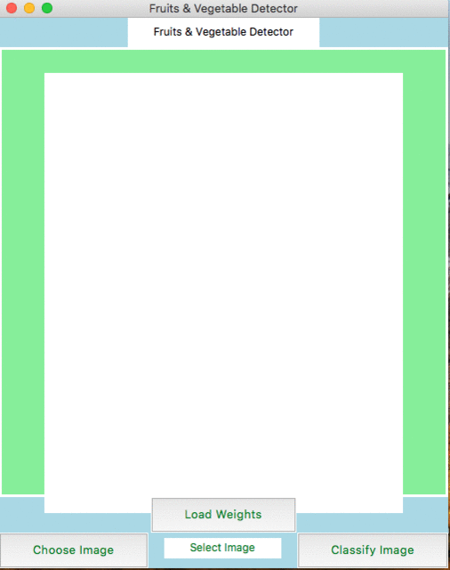

# Fruits-And-Vegetable-Detection-for-POS-with-Deep-Learning
The self-checkout portal at the supermarket gives the idea to the classification of fresh fruits and vegetables. Nowadays, more self-checkout portals are added to the time saving of the customers at the supermarket. When it comes to fresh fruits and vegetables, It still needs to enter manually into the computer for purchase and, it is a bit time-consuming and increases cheating (By putting the wrong item name). We can make use of the camera at self-checkout to get a prediction of the items using machine learning. For example, when we put tomatoes on the counter, it detects the tomatoes through a semi-transparent bag and gives various tomatoes as a list. The problem with different object detection models is to see through semi-transparent bags to classify the image. You Only Look Once (YOLO) object detection did this job well If we train the model correctly. The main stages of Object detection are data acquisition, Augmentation, Model training, Model Evaluation, and Deployment. It gives 99.4% max accuracy on the training and testing dataset to classify 14 different classes for fruits and vegetables. On real-life images, it provides approx 90% accuracy on images to classify. Prediction execution performs under a sec is considered a good result for the self-checkout terminal.
 

<h3>Full file Here in this link</h3> 
https://drive.google.com/file/d/11sgaLz8YJKlIkb-RHNDR62AdROTgyIkV/view?usp=sharing
